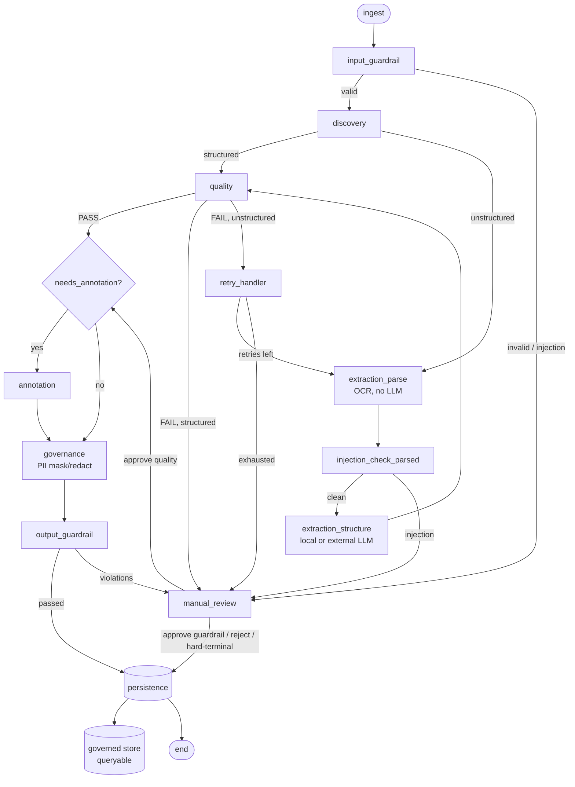

# Data Governance Pipeline

A multi-agent pipeline that turns messy files into **provably governed data you can query in plain English**.

Documents go in (CSV, JSON, PDF, images). The pipeline validates them, blocks prompt injection, routes sensitive content to a local model and everything else to a fast hosted one, checks data quality, masks or redacts PII with deterministic rules, and pauses for a human when a judgment call is genuinely needed. Only output that passed every check becomes queryable — so an answer from the query layer is, by construction, an answer over governed data.

Built with LangGraph, FastAPI, DuckDB, and Streamlit. Raw content and raw PII are never persisted, logged, or traced.

Stage-by-stage build log, including every design decision and trade-off: [PROGRESS.md](PROGRESS.md).

---

## How it works



Any node that hits a technical error sets `final_status="failed"` and routes straight to persistence, bypassing human review.

---

## The problem

Most "chat with your data" systems answer questions over whatever happens to be in the warehouse. Nobody checked whether that data was valid, whether it contains unmasked PII, or whether a human ever looked at the rows that failed validation. The governance work is assumed to have happened somewhere upstream.

This project makes the governance the product:

- **PII cannot leak into analytics** — only masked/redacted output is stored, and rows a human waved through after a guardrail failure are deliberately excluded from the queryable store.
- **Sensitive documents never reach a third-party API** — sensitivity is decided before any model is called, and the routing is fail-safe.
- **Prompt injection is caught before an LLM reads the document**, not after.
- **Humans are spent only where judgment is required** — technical failures, injection attempts, and invalid inputs never reach the review queue.
- **Every decision is auditable** without storing the data that produced it.

---

## Features

- **Multi-agent LangGraph workflow** — discovery, extraction, quality, annotation, governance, and guardrail nodes with explicit conditional routing and a failure short-circuit at every stage.
- **Sensitivity-based model routing** — local Ollama for sensitive data, hosted Groq for the rest, defaulting to local when unsure.
- **Two-layer injection defense** — text files scanned at ingestion; PDFs and images scanned on their parsed text *before* any model call.
- **Rule-based PII governance** — regex plus Luhn validation, with mask/redact/allow decided per finding, not per document.
- **Human-in-the-loop with durable pause/resume** — LangGraph checkpoints let a paused run resume from a separate HTTP request, even across a server restart.
- **Strategy-varying OCR retries** — a retry uses a different parse strategy instead of repeating the same call.
- **Governed analytical store + text-to-SQL** — natural-language questions compiled to SQL and screened by a sqlglot AST guardrail before execution.
- **Async ingestion** — `POST /ingest` returns 202 immediately; the graph runs in the background and progress is pollable.
- **Observability** — Langfuse tracing with an allow-list mask, which disables itself cleanly when no keys are configured.
- **Streamlit dashboard** — upload, review queue, query, metrics, and recent runs.

---

## Architecture

### Final statuses

| Status | Meaning |
|---|---|
| `completed` | Passed every check, or a human approved it |
| `manual_review` | Needs or received a human judgment call: rejected on review, input rejection, or injection in parsed content |
| `failed` | Technical/infrastructure error, kept separate from `manual_review` |
| `rejected` | Reserved in the schema; no current path sets it |

### Human-in-the-loop

Three situations **pause** the graph with `interrupt()` and wait for `POST /review/{document_id}`:

- structured quality failure
- unstructured extraction still failing after all retries
- output guardrail violation

Two are **hard-terminal** and never offer approval: an input guardrail rejection (nothing coherent to approve) and prompt injection found in parsed text (approving would bypass the control that fired).

Pause and resume survive separate requests and restarts, because each run is checkpointed to `data/langgraph_checkpoints.db` under `thread_id = document_id`.

### Model routing

| Sensitivity | Model |
|---|---|
| Sensitive, or unknown (fail-safe) | Local **Ollama** `llama3.2:3b` |
| Non-sensitive | External **Groq** |

Structured files are classified by column headers (`email`, `phone`, `pan`, `aadhaar`, `salary`, `card`, …). Unstructured files are classified by filename signals only — discovery deliberately runs no OCR, so a sensitive-looking name wins, a public marker (`public`, `press_release`, …) makes it non-sensitive, and no signal means sensitive.

### PII handling

Rules only, no LLM. The action is decided per finding:

| Entity | Action | Stored `masked_value` |
|---|---|---|
| Email | masked | `jo****@example.com` |
| Indian mobile phone | masked | `******3210` |
| PAN | redacted | `None` |
| Aadhaar | redacted | `None` |
| Credit card (Luhn-validated) | redacted | `None` |
| GSTIN | allowed | partially masked, never raw |

### Governed store and text-to-SQL

Curated output lands in a **third** database, `data/governed.duckdb`, separate from `pipeline.db` (outcomes) and `langgraph_checkpoints.db` (execution state). One table per `dataset_type`, with columns derived from `validation_schemas.yaml`.

A row is written only when **both** hold:

```
final_status == "completed"  AND  output_guardrail_passed is True
```

A document approved by a human *after* a guardrail failure keeps `output_guardrail_passed=False`. It stays governed, logged, and visible in the dashboard, but never becomes queryable — otherwise one override would quietly put flagged PII into an analytical table.

Generated SQL is parsed with **sqlglot** and screened before execution. The guardrail is an AST check, not a regex:

| Blocked | Example |
|---|---|
| Non-SELECT statements | `DROP`, `DELETE`, `UPDATE`, `INSERT`, `ALTER`, `TRUNCATE`, `CREATE` |
| Multiple statements | `SELECT 1; DROP TABLE …` |
| Non-governed tables | `SELECT * FROM pipeline_runs` |
| `UNION` reaching a non-permitted table | `SELECT … UNION SELECT * FROM pipeline_runs` |
| Table functions | `read_csv_auto('/etc/passwd')` |
| Admin statements | `ATTACH`, `PRAGMA`, `COPY` |

Allowed queries are wrapped in an outer `LIMIT` and run with a timeout. A blocked query returns a short, value-free reason and is logged.

### Async execution

`POST /ingest` stores the upload, writes a row, schedules the graph on a background task, and returns 202. `run_status` tracks execution independently of `review_status`:

| `run_status` | Meaning |
|---|---|
| `queued` | Accepted and persisted; graph not started |
| `running` | Background task executing the graph |
| `paused` | Interrupted at `manual_review`, awaiting a decision |
| `done` | Terminal write completed |

`pipeline.db` uses WAL with a 30s busy timeout, and writes are serialized in-process, since SQLite allows one writer at a time.

### Retry strategy

A failed unstructured extraction is retried with a **different** parse strategy, never the same call twice:

| Input | First attempt | Retry |
|---|---|---|
| PDF | `fast` | `hi_res` |
| Image | `ocr_only` | `hi_res` |

Images skip `fast` because `unstructured` rejects that strategy for image inputs. With `MAX_RETRIES=1` that is exactly one retry, then human review.

### Layout

```
src/
  config/        settings.py, validation_schemas.yaml
  graph/         state.py (PipelineState), graph.py (StateGraph), routers.py
  agents/        discovery, extraction, quality, retry, annotation, governance, manual_review
  guardrails/    input_guardrail, injection_check, output_guardrail
  pii/           rules.py (regex + Luhn, per-finding actions)
  governed/      store.py (DuckDB), sql_guard.py (sqlglot AST), text_to_sql.py
  models/        llm_clients.py (Ollama / Groq)
  persistence/   db.py, models.py, writer.py
  observability/ tracing.py (Langfuse with offline fallback)
  api/           main.py (FastAPI)
  dashboard/     app.py (Streamlit)
```

---

## Quickstart

**Prerequisites:** [uv](https://docs.astral.sh/uv/), plus system libraries for OCR and file typing:

```bash
brew install tesseract poppler libmagic
```

On Debian/Ubuntu: `tesseract-ocr`, `poppler-utils`, `libmagic1`.

Optional for live model calls: [Ollama](https://ollama.com/) (`ollama pull llama3.2:3b`) for sensitive data, and a [Groq API key](https://console.groq.com/keys) for the rest. Optional for tracing: [Langfuse](https://langfuse.com/) keys. **The test suite needs none of them.**

**Install and configure:**

```bash
uv sync
```

```bash
cp .env.example .env
```

| Variable | Default | Notes |
|---|---|---|
| `GROQ_API_KEY` | *(empty)* | Needed only for non-sensitive extraction/annotation and text-to-SQL; those runs end as `failed` without it |
| `GROQ_MODEL` | `llama-3.3-70b-versatile` | Must be a model your key can access |
| `OLLAMA_BASE_URL` / `OLLAMA_MODEL` | `http://localhost:11434` / `llama3.2:3b` | Local model for sensitive data |
| `LANGFUSE_*` | *(empty)* | Leave empty to run untraced |
| `DB_PATH` | `./data/pipeline.db` | Business outcomes |
| `DB_CHECKPOINT_PATH` | `./data/langgraph_checkpoints.db` | LangGraph execution state |
| `DB_GOVERNED_PATH` | `./data/governed.duckdb` | Governed analytical store |
| `GOVERNED_ROW_LIMIT` / `GOVERNED_QUERY_TIMEOUT_S` | `500` / `10` | Query caps |
| `MAX_RETRIES` | `1` | Retries **after** the original attempt |

**Generate fixtures, then run:**

```bash
uv run python scripts/generate_synthetic_data.py
```

```bash
uv run uvicorn src.api.main:app --reload --port 8000
```

```bash
uv run streamlit run src/dashboard/app.py
```

The dashboard talks only to the API (`API_URL`, default `http://localhost:8000`).

---

## API

Interactive docs at `http://localhost:8000/docs`.

| Method | Path | Purpose |
|---|---|---|
| `POST` | `/ingest` | Multipart `file`, `needs_annotation`, `dataset_type`. Returns **202** with `document_id` and `status: "queued"`; poll `/status/{document_id}` |
| `GET` | `/status/{document_id}` | The document's row, including `run_status` |
| `POST` | `/query` | `{"question": "...", "dataset_type": "..."}` → generated SQL plus rows, or `blocked: true` with a reason |
| `GET` | `/governed/tables` | Governed tables, columns, row counts |
| `GET` | `/reviews/pending` | Documents awaiting a decision, with value-free summaries |
| `POST` | `/review/{document_id}` | `{"decision": "approve" \| "reject", "notes": "..."}` — resumes the paused run |
| `GET` | `/dashboard-data` | Status breakdown, retry and review rates, pending count, average time, PII by type |
| `GET` | `/runs?limit=50` | Recent runs |
| `GET` | `/health` | Liveness check |

`dataset_type` values come from `src/config/validation_schemas.yaml`: `customer_records`, `product_catalog`, `documents` (use `documents` for PDFs and images).

```bash
curl -F file=@data/synthetic/customers_invalid.csv -F needs_annotation=false -F dataset_type=customer_records http://localhost:8000/ingest
```

---

## Security and privacy

- **Injection is checked before any model sees content.** CSV/JSON at ingestion; PDFs and images on their parsed text before extraction. Prompts also wrap document text in delimiters and instruct the model to treat it as data.
- **Nothing raw is persisted.** `pipeline_runs` and `pipeline_events` hold metadata, counts, value-free issue strings, and `[{entity_type, action}]` only. `raw_text`, `extracted_data`, `structured_records`, `final_content`, and every PII value — raw *or* masked — are excluded.
- **Nothing raw is traced.** Langfuse payloads pass an allow-list mask that keeps node name, status, timing, and IDs.
- **Quality issues never quote values** — messages read `row 42: email field missing`.
- **Uploaded filenames are sanitized**, including percent-encoded control characters and path traversal.
- **Only governed rows are queryable**, and generated SQL is screened by AST before it runs.

---

## Testing

```bash
uv run pytest
```

**217 tests**, no network or model access required — LLM clients are mocked and tracing self-disables.

| Area | Covers |
|---|---|
| State, routers | Defaults, every router branch, the `failed` short-circuit, retry boundary conditions |
| Discovery, guardrails | Type/sensitivity detection, size and extension rejection, injection at both layers, filename sanitization |
| Extraction, quality, annotation | Model selection by sensitivity, strategy-varying retries, schema validation, exceptions degrading to `failed` |
| Governance | Luhn-valid vs invalid cards, real vs malformed PAN, per-finding actions, `masked_value` never raw |
| Manual review | Interrupt payloads, approve/reject, and the two paths that must never interrupt |
| Governed store & SQL guard | Write conditions, human-override exclusion, every blocked SQL category, no raw PII in the store |
| API & async | 202 acknowledgement, `run_status` lifecycle, interrupt→resume from a background task, concurrent runs |
| End-to-end | Full graph runs per path, including interrupt→approve→completed and checkpoint resume across app instances |

---

## Limitations

- **Contextual PII is not detected.** Detection covers pattern-bearing entities (email, phone, PAN, Aadhaar, GSTIN, Luhn-valid cards), where a regex plus a validator is exact and explainable. Names, addresses, and locations have no such pattern and need a model — a local NER layer is the intended next step, kept local because the text may be sensitive.
- **Quality is all-or-nothing per file.** Any failing row fails the whole file; there is no row-level quarantine and no configurable failure threshold yet, so one bad row in 10,000 blocks the rest.
- **Deterministic fixes still cost a human.** An unambiguous wrong-format date goes to review instead of being normalized automatically.
- **Sensitivity for unstructured files is filename-based**, by design, since discovery runs no OCR. A misleadingly named file is classified wrongly; the default is "sensitive".
- **`processing_time_ms` includes human wait time.** It measures `completed_at − started_at`, so a reviewed document counts reviewer thinking time as pipeline time.
- **Redacted findings are intentionally not fully auditable.** For PAN, Aadhaar, and cards, `masked_value` is `None`, so a finding records *that* one was found and *where*, never any part of the value. Full traceability would need a separate, access-controlled audit store.
- **Background work is in-process.** A queued or running job does not survive a restart; there is no broker and no automatic retry.
- **Single-writer stores.** DuckDB allows one writing process, which suits this single-node setup: the API writes, the dashboard reads through it.
- **Adjacent-number ambiguity.** Identifiers separated only by single spaces can be read as one digit run by the PII rules.
- **First parse on a new machine is slow** — the initial `unstructured` run builds a font cache and downloads models.
